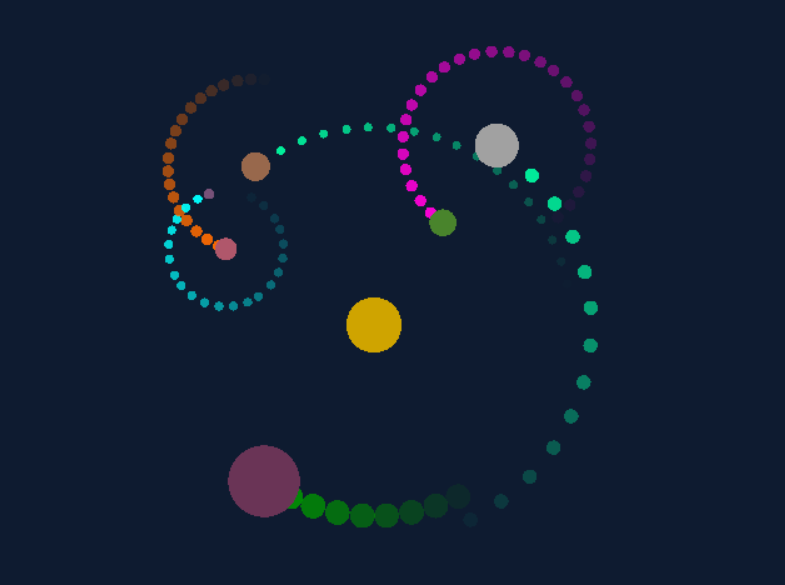
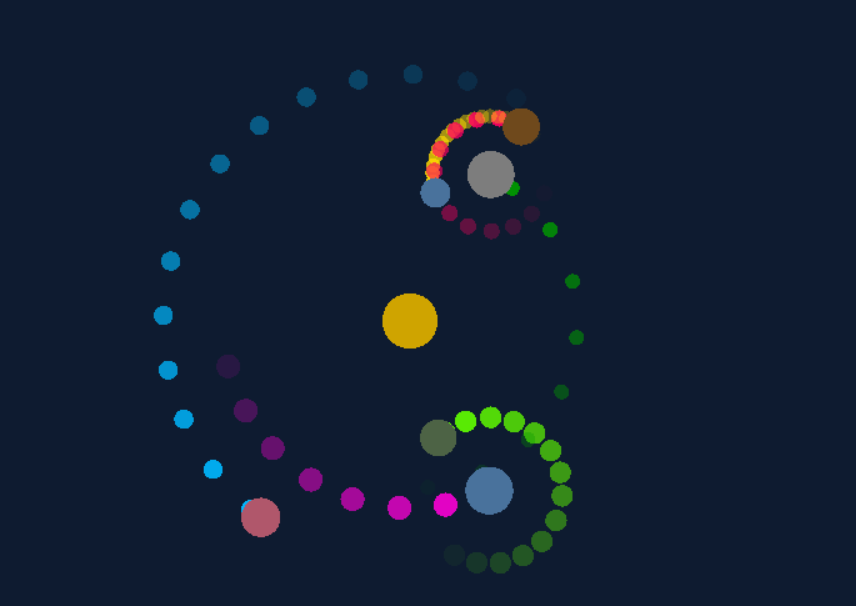

##ProceduralOrbits

A quick experimentation with procedural generation using Unity. 

Minimalist planets orbiting around a sun are procedurally generated, their number, color, 
speed, are randomly chosen, same goes for the trail they are lefting behind.

This was a very short project made within half a day around the Inktober's theme "Ring". 

Some possible results :

